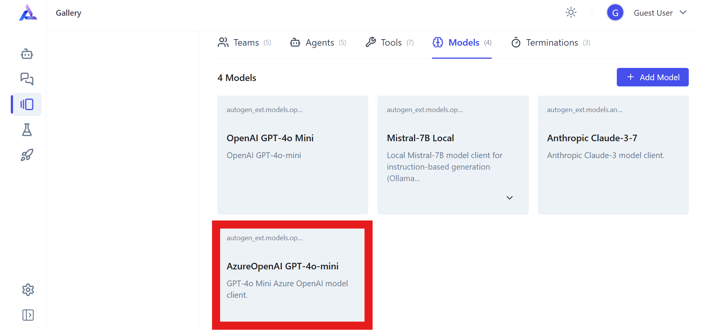

# autogen-studio
AutoGen Studio をクイックに利用するための手順書です。

## AutoGen Studio のインストール
環境のセットアップ
```
python3 -m venv .venv
source .venv/bin/activate
```

Autogen Studio のインストール
```
pip install -U autogenstudio
```

## AutoGen Studio の実行
アプリケーションの実行
```
autogenstudio ui --port 8081
```

## AutoGen Studio のセットアップ
エージェントを利用するためにはモデルの登録が必要です。
Azure OpenAI Service を利用する場合は、「Gallery」>「Models」から「AzureOpenAI GPT-4o-mini」からベース URL や API キー等の情報を登録してください。



# 参考
- インストール
https://microsoft.github.io/autogen/stable/user-guide/autogenstudio-user-guide/installation.html
- 利用方法
https://microsoft.github.io/autogen/stable/user-guide/autogenstudio-user-guide/usage.html
